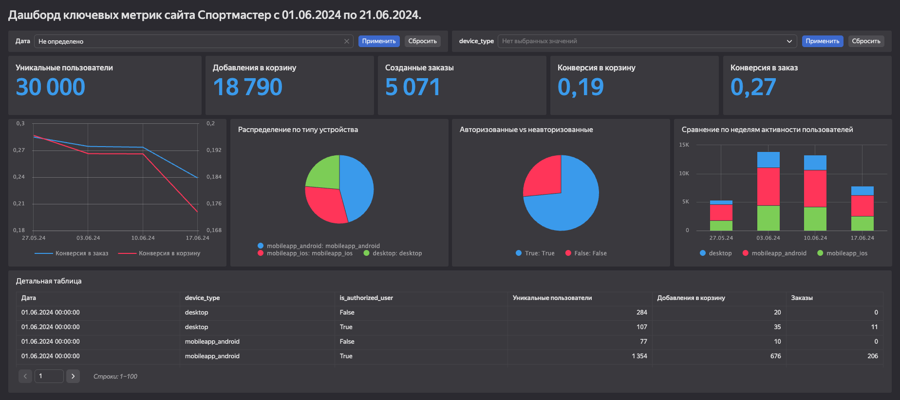

# Анализ цифровых каналов Спортмастера

## 📊 Обзор дашборда

*Рис. 1: Общий вид дашборда с ключевыми метриками и визуализациями*

**Ссылка на дашборд:** [https://datalens.yandex/yyzaxgi0b5aaj](https://datalens.yandex/yyzaxgi0b5aaj)

Дашборд предоставляет аналитику по поведению пользователей в цифровых каналах Спортмастера (сайт и мобильное приложение) за период с 1 по 21 июня 2024 года.

---

## 📁 Источники данных

- **Основной датасет:** `sportmaster_dataset.csv` (7 000 000 строк)
- **Для анализа использован:** `sm_verySmall_random.csv` (99 617 строк) - случайная выборка из полного датасета для ускорения обработки и анализа

**Период данных:** 01.06.2024 - 21.06.2024

---

##  Ключевые метрики

### Воронка продаж:
- **Просмотры карточек товаров** - клики на карточку товара
- **Добавления в корзину** - пользователи, добавившие товары в корзину
- **Оформление заказов** - завершенные покупки
## 📈 RFM-анализ клиентов

---

### Методология сегментации:
Проведен RFM-анализ пользователей, совершивших покупки (`create_order_flag == 1`):

- **Recency (R):** Количество дней с последней покупки
- **Frequency (F):** Количество совершенных заказов
- **Monetary (M):** Общая сумма покупок

---
  
### Показатели эффективности:
- Уникальные пользователи
- Конверсия в корзину
- Конверсия в заказ
- Распределение по устройствам (desktop/mobile)
- Динамика по дням/неделям

---

## 👥 Предназначение

Дашборд предназначен для:
- Маркетинг-менеджеров
- Аналитиков digital-каналов
- Product-менеджеров
- Руководителя отдела продаж

---

## 💡 Как использовать

1. Используйте фильтры для анализа конкретного периода
2. Сравнивайте показатели между разными устройствами
3. Отслеживайте динамику ключевых метрик во времени
4. Анализируйте конверсию на каждом этапе воронки
5. Выявляйте проблемные зоны для оптимизации

> **Примечание:** Для полного анализа рекомендуется использовать полный датасет на 7M строк после подтверждения гипотез на уменьшенной выборке.
